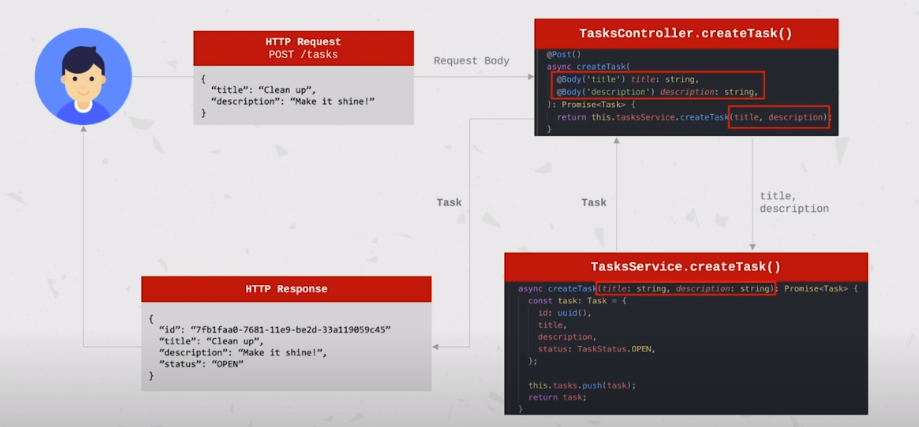

# NestJS Controllers

* Responsible for handling incoming **request** and returning **reponses** to the client
* Bound to a specific **path** (ex: "/tasks" for the task resource)
* Contain **handlers**, wich handle **endpoints** and **requests methods**
* Can take advantage of **dependecy injection** to consume providers within the same module

[Resource](https://docs.nestjs.com/controllers)

# Providers

The main idea of a provider is that can inject dependecies; this means objects can create various relationship with each other, and the function of "wiring up" instances of objects can largely be delegated to the Nest runtime system.

# Data Transfer Object (DTO)

> " A Data Transfer Object is an object that is used to encapsulate data, and send it from one subsystem of an application to another. - What is a Data Transfer Object", StackOverflow "

We can use this or another project without DOts, but changes in the project can be painful.
In this image, we do not have a unified way to define what the data looks like around the process.

